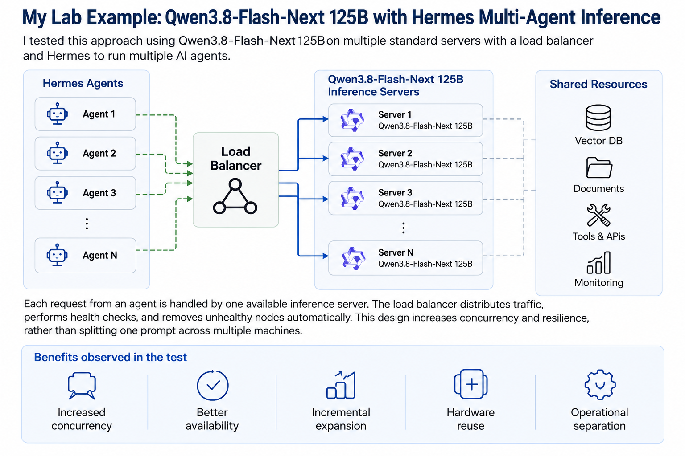

# You Don’t Need an Expensive GPU Cluster to Start with Private AI

This paper documents my lab testing of private AI using:

- Qwen3.8-Flash-Next 125B
- Standard enterprise servers
- Multiple inference nodes
- Load balancing
- Hermes multi-agent workflows

## Architecture

Hermes Agents → Load Balancer → Multiple Qwen3.8-Flash-Next 125B inference servers

## Key idea

The objective was not model parallelism.

Each inference request was handled by one server, while the load balancer distributed independent requests across multiple nodes.

This allowed me to test horizontal inference scaling for:

- Higher concurrency
- Multiple AI agents
- Improved availability
- Incremental capacity expansion
- Reuse of existing enterprise hardware

## Full paper

[Download the PDF](You-Dont-Need-an-Expensive-GPU-Cluster.pdf)

## Author

Elad Kurzweil

Topics: Private AI, AI Infrastructure, LLM, Qwen, Hermes, Enterprise AI
